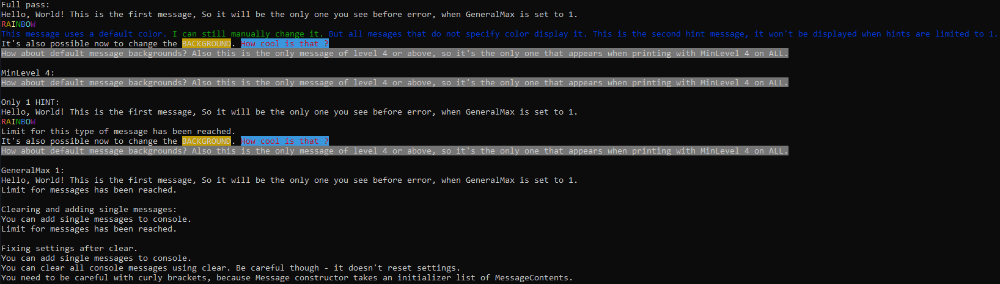

# Printer

[Description](#Description)  
[Interface](#Interface)  
[Usage](#Usage)  
[Files](#File-list)  
[Notes](#Notes)

# Description

This module provides functionality for outputting messages to console. Has tools to help put messages together from smaller parts, like error messages. Additionally contains cool features like changing font and background colors.

# Interface

## Files:

* [message.hpp](src/printer/message.hpp) - Description of Message objects.
* [printer.hpp](src/printer/printer_console.hpp) - Interface of a printer to console (maybe other printers will appear in the future).
* [printer.cpp](src/printer/printer.cpp) - Implementation of a printer to console.

## Symbols:

All symbols are in namespace `printer`.

### TYPE_COUNT

Indicates how many different message types there are.
~~~~~cpp 
constexpr usize TYPE_COUNT;
~~~~~

### MessageType 

Contains message types, including `ERROR`, `DEBUG`, `NOTE`, `HINT`, `WARNING` and 'GENERAL'. Normal message types are enumerated from 0 to `TYPE_COUNT - 1`. Also has type `ALL` used exclusively to change `Console` options.
~~~~~cpp 
enum class MessageType;
~~~~~

### Console class

You can add `Message`s to it, change its settings and print its contents to console.

#### Constructor

~~~~~cpp 
Console(usize generalMax = SIZE_MAX, minLevel_t minLevel = defaultMinLevel, maxAmounts_t maxAmounts = defaultMaxAmounts);
~~~~~

* generalMax
  
  Specifies total maximum amount of messages displayed when printing. Helps prevent excess flooding of the console.

* minLevel
  
  `minLevel_t` is typedef for `std::array<LevelType, TYPE_COUNT>` (`LevelType` is `int32_t`).
  Specifies minimal level (of importance) for messages of each type to be displayed. Helps skip less important messages to not flood the console.
  Default is `0` for all types.

* maxAmounts
  
  `maxAmounts_t` is typedef for `std::array<usize, TYPE_COUNT>`.
  Specifies maximum amount of each type of messages to be displayed. Helps not display some kind of messages and limit flooding by specific types of messages.
  Default is `SIZE_MAX` for all types.

#### Change settings

When changing a setting, one can use `MessageType::ALL` to change it for all types instead of a specific one.

* setMinLevel
  
  Sets [minLevel](#minLevel) for a type.
  ~~~~~cpp
  void setMinLevel(MessageType type, LevelType level);
  ~~~~~

* setGeneralMax
  
  Sets [generalMax](#generalType).
  ~~~~~cpp
  void setGeneralMax(usize max);
  ~~~~~

* setMaxAmounts
  
  Sets [maxAmounts](#maxAmounts) for a type.
  ~~~~~cpp
  void setMaxAmounts(MessageType type, usize amount);
  ~~~~~

#### add

Adds a message pack (`std::vector<Message>`) or a single message to the console.
~~~~~cpp
void add(MessagePack pack);
void add(Message message);
~~~~~

#### print

Prints added messages using settings' logic to specified ostream. Cerr by default.
~~~~~cpp
void print(std::ostream& out = std::cerr);
~~~~~

#### clear

Clears all messages from the console. Does not change settings.
~~~~~cpp
void clear();
~~~~~

### Color

Enumerates colors for characters and backgrounds. Important to note that colors are inconsistent across terminals. More about it and preview of colors in different terminals [here](https://en.wikipedia.org/wiki/ANSI_escape_code#Colors). There are two special colors - `DEFAULT` and `RESET`. `DEFAULT` is used for `MessageContent` only and sets the color to `Message`'s default. Don't set `Message`'s color to `DEFAULT`. `RESET` resets color setting to terminal's default.
~~~~~cpp
enum class Color;
~~~~~

### MessageContent class

Text with color information. Constructors:
~~~~~cpp
		MessageContent(
			const char* str, 
			Color foreground_color  = Color::DEFAULT, 
			Color background_color = Color::DEFAULT);

		MessageContent(
			MessageContentText str, 
			Color foreground_color  = Color::DEFAULT, 
			Color background_color = Color::DEFAULT);
~~~~~
MessageContentText is just `std::string`. First color is the character color, second one is the background color. If color is omitted not specified, it defaults to `Message`'s default color.

### Message class

Combines `MessageContent`s together into a message.

#### Constructor
~~~~~cpp
		Message(
			std::vector<MessageContent> list,
			MessageType type = MessageType::GENERAL,
			LevelType level = 0,
			Color foreground_color = Color::RESET,
			Color background_color = Color::RESET)
~~~~~
You can read more about `MessageType` [here](#MessageType). If omitted defaults to `GENERAL`.
`LevelType` is typedef of `int32_t` and notes message's importance to console. If omitted defaults to 0.
First color is `Message`'s default character color, second is `Message`'s default background color. If omitted both default to `RESET` - terminal's default.

#### add

Adds `MessageContent`(s) to the message.

~~~~~cpp
		void add(MessageContent);
		void add(std::vector<MessageContent>);
~~~~~

#### print

Prints the message to specified ostream (std::cerr by default).

~~~~~cpp
		void print(std::ostream& out = std::cerr);
~~~~~

# Usage

[example.cpp](examples/example.cpp).

Code output:

# Notes

We might want to suppress/change the debug messages that show when reaching a limit for generalMax or maxAmounts.
