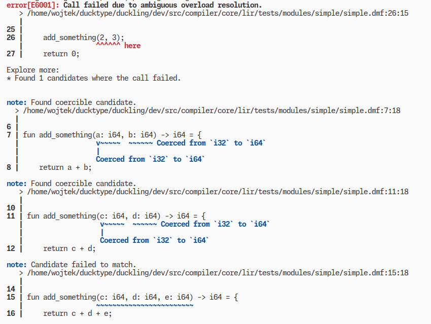

@page dia-templates Diagnostic templates

Diagnostic templates (or, actually, *message templates*) are recipes for
converting the raw diagnostic data
emitted by the compiler into a human-readable messages.

They offer methods to embed diagnostic data into the message,
potentially using some basic logic on that data to alter the content
of the diagnostic message.

Thanks to the templates, the compiler itself can be agnostic of the textual
representation of diagnostic messages, a decoupling which facilitates
continuous improvement of said representation independently
from the compiler's source code.

> This document goes through the technicalities of creating and using
message templates. For more information on guidelines about writing the content
of these templates, see the \ref dia-guidelines page.

## Anatomy of a message template
A message template describes the representation of a standalone, coherent
piece of a diagnostic referred to as an *info*. That info can in turn
contain a header component, an optional description component, a fragment of code
with inline messages (referred to as *pointer messages*),
and a series of, potentially interactive, triggers (called *explore links*)
representing links to other infos specified by the compiler.

For that reason, the template itself is divided into sections (some optional)
corresponding to each of the aforementioned info components.

### Metadata
> Note: this section is **mandatory**.

Every template file is identified by its `template_type` and a triple of
names: `(type, family, name)`.

The `template_type` defines the structure of the template file. It can be one of:
- `message` (for full diagnostic messages – `MessageTemplate`),
- `component` (for reusable components – `ComponentTemplate`),
- `pointer_message` (for standalone pointer-message templates –
  `PointerMessageTemplate`).

The `type` is one of:
## Anatomy of a message template
A message template is represented as a tree, where each component
introduces new content or functionality to the message. There are a couple
of component types, depending on their purpose:
- text component,
- concatenation component,
- parameter component,
- is param provided component,
- macro component,
- matching component,
- code block component,
- message link component,
- variant component.

The whole triple is required to be reflected in the directory structure
inside the template directory.

The metadata also includes information about the range of versions the template
was (or has been) in use, as well as an *info code* - an integer which,
along with the aforementioned `type` can also be used to identify the template.

> In diagnostic messages you often see text like `error[E1001]: ...`.
The `E` in square brackets means an `error` type of the info and the number
`1001` is the *info code*. Together, they uniquely identify the used message
template.
>
> Note: the mechanism for global assignment of info codes has not yet been
developed. When you design a message template, manually make sure to pick
an info code which has not yet been taken.

~~~~~yaml
metadata:
  template_type: "message"
  type: "note"
  family: "declaration"
  name: "variable_decl"
  code: "1001"
  active_from: "0.0.1"
  active_until: "now"
~~~~~
> An example of a template's metadata section. This template file must reside
inside the `note/declaration/` directory and be named `variable_decl.yaml`.

### Parameters
> Note: this section is **optional**.

Every template can be parameterized by a set of arguments passed down
by the compiler and each such argument is required to be a *component*
in a View Manager sense (more on that in the \ref dia-file document).

In short, a *component* is a piece of text with metadata which can affect
its display style and introduce interactivity. In particular, a component
might be subject to *in-place transformations* which means that after some user
interaction its textual content might change.

Due to the wide range of transformations that a parameter can undergo,
it is required to create a specification of all parameters
used in a template. Each parameter specification must include a `description`
field documenting its purpose.

> Parameter descriptions are **essential** to creating valid message templates.
They serve as a specification of what the compiler is expected to pass down
to the template and can convey crucial, nontrivial information about
the parameters' allowed behaviour (e.g. by limiting the use of in-place
transformations in certain delicate cases).

Some template parameters in the specification can be marked as optional.
Additionally, a `component_type` can be specified to hint the expected type
of the parameter (e.g., `code`, `concat`, `evaluated_template`).

~~~~~yaml
params:
  operator:
    description: "The operator which does not match."
    component_type: "code"
  left_type:
    description: "Type of the left operand."
    component_type: "evaluated_template"
  right_type:
    description: "Type of the right operand."
    component_type: "evaluated_template"
  is_static:
    description: "Whether the error is displayed in a static message."
  has_expanded_left_type:
    description: "Whether the type of the left operand can be expanded."
  expanded_left_type:
    description: "Expanded type of the left operand."
    optional: true
  has_expanded_right_type:
    description: "Whether the type of the right operand can be expanded."
  expanded_right_type:
    description: "Expanded type of the right operand."
    optional: true
~~~~~
> An example of a template's parameters specification. The `expanded_left_type`
and `expanded_right_type` parameters are optional. That is, they do not need
to be passed down by the compiler.

### Main components
There are two main components displayed within an info:
- a header component (required),
- a description component (optional).

Both of these are defined at the root level of a message template file
in the following way:
~~~~~yaml
header_message: <component>
description: <component>
~~~~~
where `<component>` is a message template component (more on those in the
[**Anatomy of a message template**](#anatomy-of-a-message-template) section of this document).
The `description` field is optional.

### Pointer messages
> Note: this section is **optional**.

An info's message template may define a set of components to be displayed inside
the code fragment provided by the compiler (aka *pointer messages*,
because they *point* to their respective code fragment segments).

Each pointer message is identified by a *group name* (referring to the group
of components that it points to) and must be assigned:
- a type (one of the info types mentioned in subsection
[**metadata**](#metadata); in some UI's a pointer message may be displayed
differently based on what type of information it conveys),
- content (a message template component tree).

Optionally, a priority can be assigned:
Anatomy of a message template
A message template is represented as a tree, where each component
the UI may use that information for ordering pointer messages, should they
- component types, depending on their purpose:
- text component,
- concatenation component,
- parameter component,
- is param provided component,
- macro component,
- matching component,
- code block component,
- message link component,
- variant component.
file. All pointer messages should be defined under
the `pointer_messages` node at the root of the file.
not all branches of the template tree have to be evaluated), which is crucial
### Explore links
Certain pieces of diagnostic data may be represented
as a directed graph. Sometimes it might be useful
### Text component
The text component is just plain text. It does not introduce any metadata.
a path from the starting vertex and choosing where
to go next or where to go back.

For these scenarios you can use explore links
in your message templates.

### Concatenation component
The concatenation component, as the name suggests, concatenates multiple components.
explore links are the outgoing edges of their corresponding
vertices.
Since the outgoing degrees of vertices are unbounded,
and another text component.
the templates of explore links define *classes* of links
and not every individual one (otherwise the number
### Parameter component
The parameter component, upon evaluation, is replaced by the template parameter
to be bounded or even constant).
The compiler may then provide information about multiple
it is possible for such a component to exist in the message template tree
according to that class' explore link template.
(local parameters shadow the global ones).
the parameter component is replaced by the local parameter
(local parameters shadow the global ones).
Each link class may define a set of parameters
(specified in the same way as in the
[**parameters**](#parameters) subsection)
it accepts and use these parameters, alongside
the global info parameters in its `content` field.
### Is param provided component
The is param provided component checks if a parameter is provided. It evaluates to "true" or "false".
It is often used as the `case` component in a matching component.
parameters shadow the global info parameters.

Since explore links' primary objective is to provide
interaction on an info graph, all metadata of their
contents is dropped. That means, in particular, that
### Macro component
The macro component, upon evaluation, is replaced by the content of the macro
explore link's text.

~~~~~yaml
explore_links:
  <link_class>:
### Matching component
The matching component introduces logic to the message template evaluation.
    params: <params>
 *class cases* are specified in square brackets,
 `[other]` is a special class case, required in every matching component,
All explore links should be defined under the `explore_links`
case: <component>

  <case_1>: <component>
  <case_2>: <component>
  "[other]": <component>
duplication the the template file. Such macros are basically
just aliases for potentially long and complicated message
templates.

~~~~~yaml
### Code block component
The code block component represents a block of code, optionally with a location.
  <macro_name>: <component>
codeblock: <component>
> A scheme for defining a macro in the template file.
All macros should be defined under the `macros` node
at the root of the file.

## Anatomy of a message template
### Message link component
The message link component represents a link to another message.
A message template (`<message>`) is represented as a tree, where each node
content: <component>
of node types, depending on their purpose:
- text node,
- concatenation node,
- parameter node,
- is param provided node,
### Variant component
The variant component allows providing a default content and an alternative content.
- matching node,
default: <component>
alternative: <component>
- variant node.

All message templates are evaluated lazily (thanks to the matching node,
not all branches of the template tree have to be evaluated), which is crucial
for handling optional template parameters.

### Text node

The text node is just plain text. It does not introduce any metadata.
Text nodes are leaves in the message template node tree.

~~~~~yaml
"Example text node in quotes."

Example text not in quotes.

>
Example text
that is split
across multiple lines
for readability.
~~~~~
> Examples of text nodes. Because the general format of the template file
is YAML, the text can be specified with and without quotes. It can also
be split into multiple lines.

### Concatenation node

The concatenation node, as the name suggests, concatenates multiple nodes.
It is represented as a YAML list.

~~~~~yaml
- "The parameter is "
- param: "my_parameter"
- "."
~~~~~
> Example of a concatenation node comprising of a text node, a parameter node,
and another text node.

### Parameter node

The parameter node, upon evaluation, is replaced by the template parameter
it refers to which has been passed down by the compiler.

Evaluating a missing optional parameter results in an error.
However, because of lazy and conditional template evaluation
(see [**the matching node**](#matching-node)),
it is possible for such a node to exist in the message template tree
provided it does not get evaluated.

When evaluated inside an edge class' message template, and if there are two
parameters of the same name (one global for the entire info and one local
for this edge class), the parameter node is replaced by the local parameter
(local parameters shadow the global ones).

~~~~~yaml
param: <param_name>
~~~~~
> A scheme for defining a parameter node.

### Is param provided node

The is param provided node checks if a parameter is provided. It evaluates to "true" or "false".
It is often used as the `case` component in a matching node.

~~~~~yaml
is_param_provided: <param_name>
~~~~~
> A scheme for defining an is param provided node.

### Macro node

The macro node, upon evaluation, is replaced by the content of the macro
it refers to.

~~~~~yaml
macro: <macro_name>
~~~~~
> A scheme for defining a macro node.

### Matching node

The matching node introduces logic to the message template evaluation.
Upon evaluation, the content of the `case` field (which is a component itself)
is evaluated and then matched with all cases specified in the `of` field.
Once a match is found, all other cases are discarded.

~~~~~yaml
case: <message>
of:
  <case_1>: <message>
  <case_2>: <message>
  "[other]": <message>
~~~~~
> A scheme for defining a matching node. Any number of cases can be introduced.
The `[other]` class case is required.

### Code block node

The code block node represents a block of code, optionally with a location.

~~~~~yaml
codeblock: <message>
location: <message> # optional
~~~~~
> A scheme for defining a code block node.

### Message link node

The message link node represents a link to another message.

~~~~~yaml
content: <message>
url: <message>
~~~~~
> A scheme for defining a message link node.

### Variant node

The variant node allows providing a default content and an alternative content.

~~~~~yaml
default: <message>
alternative: <message>
~~~~~
> A scheme for defining a variant node.
